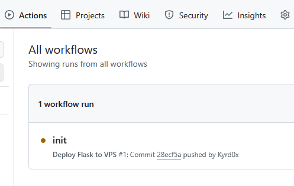

# Flask - Docker démo

[](https://www.python.org/)
[](https://flask.palletsprojects.com/)
[](https://www.docker.com/)

  

Ceci est une démonstration très basique du système de containerisation d'un application Flask, contenant:
- ```app.py```: Application Flask qui affiche les infos d'un fichier uploadé.
- ```deploy.yml```: Pipeline minimaliste pour déployer le container sur un serveur.
- ```Dockerfile```: Fichier de configuration du container Docker


## environnement virtuel Python

```bash
# Création environnement virtuel Python 'env'
python3 -m venv env
# Activation de l'environnement
source env/bin/activate
# Installation des dépendances
pip install -r requirements.txt

# ... utilisation ...

# Quitter en faisant
deactivate
```

## Utilisation de Flask

Une fois les dépendances installées, l'utilisation de flask est comment n'importe quel script:
```bash
python3 app.py
```

## Installation Docker

Linux:
```bash
# Récupère l'installeur officiel
curl -fsSL https://get.docker.com -o get-docker.sh
# L'exécuter
sudo sh ./get-docker.sh
# Ajouter le user au groupe docker si nécessaire
sudo usermod -aG docker $USER
```

Windows: [https://docs.docker.com/desktop/setup/install/windows-install/](https://docs.docker.com/desktop/setup/install/windows-install/)

## Utilisation Docker

Une fois installé, se rendre dans le projet et faire
```bash
# Construction de l'image du Container, basé sur le Dockerfile
docker build -t flask-demo-img .

# Lancement du container en utilisant l'image précedement créée, ici sur le port 5000
docker run -d --name flask-demo-app -p 5000:5000 flask-demo-img
```

L'application est maintenant accessible sur [http://localhost:5000](http://localhost:5000).

## Pipeline Github

Nom officiel: **Github Action**\
Fichier: ```.github/workflows/deploy.yml```

Le principe de cette Pipeline est le suivant:
- se déclenche lors d'un ```push``` sur ```main```
- récupére ce projet github sur un ubuntu
- l'envoi sur un serveur distant via SCP
- contruit et démarre le container de l'application

Dans les paramètres du projet github il faut définir 3 secrets: ```VPS_HOST```, ```VPS_USER``` et ```VPS_SSH_KEY``` dans le but de ne pas les exposer en clair dans la pipeline.

Définir les secrets sur ```https://github.com/<github-pseudo>/<repo-name>/settings/secrets/actions```


L’exécution est visible dans l’onglet "Actions" du dépôt : https://github.com/<github-pseudo>/<repo-name>/actions



Pour github, tous les fichiers ```.yml``` se trouvant dans ```.github/workflows/``` seront interprétés comme des pipelines.

## Disclaimer

Ceci est un exemple **très basique** qui a pour but de montrer la simplicité d'utilisation de l'écosystème Docker/Flask/Github, **ne pas utiliser** tel quel dans un **environnement de production**.
